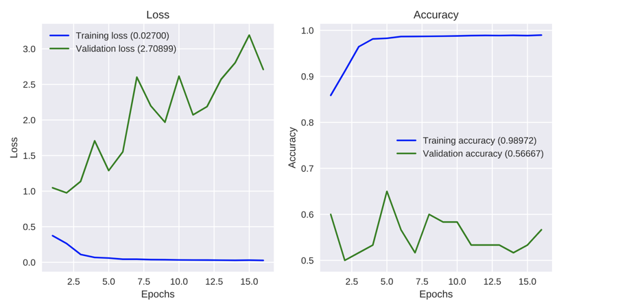
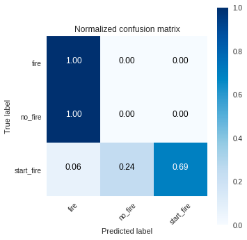

= Hands-on AI - Rapport - Defi 1
:author: Geoffrey Picron, Michael Rombaux
:doctype: article
:encoding: utf-8
:lang: fr
:toc: left
:math:
:numbered:

[abstract]
--
Afin de construire un classifieur capable de distinguer des images en trois classes (départ de feu de forêt, feu de forêt et pas de feu), nous avions à notre disposition 4 ensembles de fichiers image (small, medium, big, huge).

Dans un premier temps, nous avons pris comme stratégie d'utiliser une architecture de réseau de neurones CNN pré-entrainé pour extraire les features à laquelle nous ajouterions une ou plusieurs Dense et Dropout.

Afin d'évaluer la performance de differentes architectures, nous avons utilisé la méthode de validation croisée.
Néanmoins, les images mise à disposition étant issue de séquence video, les images successive sont très semblables et les résultats d'une évaluation par la méthode de validation croisée risquent d'être trop optimiste et les paramètres optimum inférés de conduire à un overfitting. Afin de limiter cette possibilité, nous avons introduit des variations (rotation, rognage, flip, contraste, luminosité) sur les images reçues.

Après quelques essais, nous avons développé un Helper qui automatise l'exploration des architecture et paramètres les plus performants. Ce Helper utilise un algorithme d'optimisation Bayesien (TPE, tree of Parzen estimators) pour optimiser le choix des paramètres.

Les premières analyses semblent montrer que des architectures pré-entrainées d'extractions de feature les plus "simples" fournissent les meilleurs résultats.

En effet, si l'on considère le problème proposé, intuitivement, il s'agit essentiellement de détecter une zone de couleurs "feu" dans une zone de couleurs "forêt" et/ou une zone de "fumée" issue d'une zone de couleurs "forêt". Et d'éviter de confondre avec le "soleil" et les "nuages".

Le modèle finalement choisi a été entraîné avec les images du dataset "huge" augmentées et testé avec les images du dataset "images_test" augmentées.
--

[IMPORTANT]
====
Le code source se trouve principalement dans notebook colab ci-joint.  Néanmoins, nous avons créé un module python contenant les routines que nous prévoyons de pouvoir réutiliser pour les prochains défis. Le module est publié sur GitHub à l'adresse https://github.com/gpicron/ia_tools
====

== Preparation des données
Pour la partie exploration des architectures possibles, nous avons exploité le dataset "big". Pour l'entraînement, de l'architecture que nous avons finalement choisie, nous avons utilisé le dataset "huge"

Nous avons utilisé la technique de "Data augmentation" avec la librairie _Augmentor_<<Augmentor>> pour améliorer de nos dataset. La configuration utilisée applique un certain nombre de modifications  aléatoirement sur les images d'origine:

- miroir horizontal
- rotation entre -20° et 20°
- zoom de 1.1 à 1.5 fois
- extraction d'une zone de 70% de la surface totale l'image
- modification du contraste
- modification de la luminosité

Et finalement, le plus grand "carré" au centre de l'image et extrait de l'image et redimensionné à la taille d'input de notre architecture.

.Exemples d'images d'entraînement augmentées
[cols="^,^,^", width="100%"]
|====================
| fire | start_fire | no_fire 
a|image::images/Image-101018-103301.993.png[scaledwidth="3cm"] a|image::images/Image-101018-103656.972.png[scaledwidth="3cm"] a|image::images/Image-101018-103831.683.png[scaledwidth="3cm"] 
|====================

== Architecture paramétrique du classifieur
Nous avons conçu un fonction python qui nous permet de construire différentes architectures pour notre classifieur.  Nos classifieurs sont composés:

- des couches de convolution d'un modèle pré-entraîné de la librairie _Keras_<<Keras_apps>>
- d'une couche GlobalAveragePooling2D
- de une ou plusieures couches Dense (activation relu) intercallée optionnelle de couche Dropout 
- d'une couche Dense à 3 neurones pour la sortie en activation softmax

.Paramètres de la fonction de construction d'un classifieur
[cols="1,3",width="100%",options="header"]
|====================
| Paramètre | Description  
| keras_app | le nom de modèle pré-entraîné pour les couches de convolution
| layers | le nombre de couches Dense après les couches de convolution et avant la couche de sortie 
| units | le nombre de neurones par couche Dense est déterminé par la formule _units * units_alpha^n_, avec _n_ le numéro de la couche commençant par 0 
| units_alpha |  voir units
| dropout |  le taux de drop de la couche intercalaire Dropout déterminé par la formule _dropout * dropout_alpha^n_, avec _n_ le numéro de la couche commençant par 0
| dropout_alpha |  voir dropout
|====================

== Exploration des variations d'architecture du classifieur
Pour explorer les differentes variation sur base de notre architecture paramétrique  dans colab, nous avons développer un Helper basé sur la librairie  _hyperopt_<<hyperopt>>. Cette librairie utilise un algorithme d'optimisation Bayesien (TPE, tree of Parzen estimators) pour diriger l'exploration des combinaisons de paramètres dans un espace de recherche donné en cherchant à minimiser une fonction objective.  

Pour notre exploration, la fonction objective consiste à entraîner une architecture selon les paramètres choisis par _hyperopt_ et à evaluer sa performance par rapport au dataset "test" et en validation croisée.

Pour la première exploration, nous avons ouvert l'espace de recherche à de nombreuses possibilités.

[IMPORTANT]
====
La mémoire du GPU dans colab est limité à 12GB, cela a posé des problèmes pour entraîner des arcchitectures à base de Xception, ResNet50 et Incepttion.
====

=== Exploration large 

.Espace des paramètres, exploration large
[cols="1,3",width="100%",options="header"]
|====================
| Paramètre | Espace des valeurs possibles  
| classifier_base | 'MobileNet', 'VGG16', 'VGG19'
| epochs | [2,4,8,16,32,64]
| batch_size | de 4 à 24 par pas de 4
| layers | de 1 à 4
| units | de 128 à 1024 par pas de 128
| units_alpha |  entre 0.5 et 2.0
| dropout |  entre 0.25 et 1.0
| dropout_alpha |  entre 0.5 et 2.0
|====================

.Analyse des paramètres, exploration large

[TIP]
====
Dans le graphique ci-dessus, en abscisse, nous avons l'itération de recherche, en ordonnée la valeur prise par le paramètre pour cette itération, et le point est d'autant plus foncé que l'accuracy de l'architecture testée pour le dataset "test"
====

Après quelques itérations, il nous a semblé que les architectures à base de MobileNet était la plus prometteuse.  Par ailleurs, lors de précédentes exécutions de la recherche nous avions constaté que les entraînements de moins de 16 époques ne donnaient jamais de bons résultats.
Il est probable que les architectures à base de VGG16 et VGG19, qui ont beaucoup plus de paramètres, donneraient de meilleurs résultats avec plus d'époques d'entrainement.
Pour la suite, nous avons limité l'espace de recherche à MobileNet avec un minimum de 16 époques.

=== Exploration affinée 

.Espace des paramètres, exploration affinée
[cols="1,3",width="100%",options="header"]
|====================
| Paramètre | Espace des valeurs possibles  
| classifier_base | 'MobileNet'
| epochs | [16,32,64]
| batch_size | de 4 à 24 par pas de 4
| layers | de 1 à 4
| units | de 128 à 1024 par pas de 128
| units_alpha |  entre 0.5 et 2.0
| dropout |  entre 0.25 et 1.0
| dropout_alpha |  entre 0.5 et 2.0
|====================

.Analyse des paramètres, exploration affinée

Avec le nombre d'itérations effectuées, il n'est pas possible de dégager de tendance claire.  Il faudrait continuer les itérations mais nous manquons de temps.
Nous utiliserons le meilleur paramétrage trouvé pour la suite.

== Architecture sélectionnée & résultats

Nous avons construit le modèle avec les meilleurs paramètres trouvés durant l'exploration.

.Paramètres choisis
[cols="1,3",width="100%",options="header"]
|====================
| Paramètre | Valeur  
| classifier_base | 'MobileNet'
| batch_size | 12
| layers | 4
| units | 256
| units_alpha | 1.639789202190635
| dropout | 0.37109677567186583
| dropout_alpha | 1.0027477957252686
|====================

.Description du modèle
----
Layer (type)                 Output Shape              Param #   
=================================================================
input_3 (InputLayer)         (None, 224, 224, 3)       0         
_________________________________________________________________
conv1_pad (ZeroPadding2D)    (None, 226, 226, 3)       0         
_________________________________________________________________
conv1 (Conv2D)               (None, 112, 112, 32)      864       
_________________________________________________________________
conv1_bn (BatchNormalization (None, 112, 112, 32)      128       
_________________________________________________________________
conv1_relu (Activation)      (None, 112, 112, 32)      0         
_________________________________________________________________
conv_pad_1 (ZeroPadding2D)   (None, 114, 114, 32)      0         
_________________________________________________________________
conv_dw_1 (DepthwiseConv2D)  (None, 112, 112, 32)      288       
_________________________________________________________________
conv_dw_1_bn (BatchNormaliza (None, 112, 112, 32)      128       
_________________________________________________________________
conv_dw_1_relu (Activation)  (None, 112, 112, 32)      0         
_________________________________________________________________
conv_pw_1 (Conv2D)           (None, 112, 112, 64)      2048      
_________________________________________________________________
conv_pw_1_bn (BatchNormaliza (None, 112, 112, 64)      256       
_________________________________________________________________
conv_pw_1_relu (Activation)  (None, 112, 112, 64)      0         
_________________________________________________________________
conv_pad_2 (ZeroPadding2D)   (None, 114, 114, 64)      0         
_________________________________________________________________
conv_dw_2 (DepthwiseConv2D)  (None, 56, 56, 64)        576       
_________________________________________________________________
conv_dw_2_bn (BatchNormaliza (None, 56, 56, 64)        256       
_________________________________________________________________
conv_dw_2_relu (Activation)  (None, 56, 56, 64)        0         
_________________________________________________________________
conv_pw_2 (Conv2D)           (None, 56, 56, 128)       8192      
_________________________________________________________________
conv_pw_2_bn (BatchNormaliza (None, 56, 56, 128)       512       
_________________________________________________________________
conv_pw_2_relu (Activation)  (None, 56, 56, 128)       0         
_________________________________________________________________
conv_pad_3 (ZeroPadding2D)   (None, 58, 58, 128)       0         
_________________________________________________________________
conv_dw_3 (DepthwiseConv2D)  (None, 56, 56, 128)       1152      
_________________________________________________________________
conv_dw_3_bn (BatchNormaliza (None, 56, 56, 128)       512       
_________________________________________________________________
conv_dw_3_relu (Activation)  (None, 56, 56, 128)       0         
_________________________________________________________________
conv_pw_3 (Conv2D)           (None, 56, 56, 128)       16384     
_________________________________________________________________
conv_pw_3_bn (BatchNormaliza (None, 56, 56, 128)       512       
_________________________________________________________________
conv_pw_3_relu (Activation)  (None, 56, 56, 128)       0         
_________________________________________________________________
conv_pad_4 (ZeroPadding2D)   (None, 58, 58, 128)       0         
_________________________________________________________________
conv_dw_4 (DepthwiseConv2D)  (None, 28, 28, 128)       1152      
_________________________________________________________________
conv_dw_4_bn (BatchNormaliza (None, 28, 28, 128)       512       
_________________________________________________________________
conv_dw_4_relu (Activation)  (None, 28, 28, 128)       0         
_________________________________________________________________
conv_pw_4 (Conv2D)           (None, 28, 28, 256)       32768     
_________________________________________________________________
conv_pw_4_bn (BatchNormaliza (None, 28, 28, 256)       1024      
_________________________________________________________________
conv_pw_4_relu (Activation)  (None, 28, 28, 256)       0         
_________________________________________________________________
conv_pad_5 (ZeroPadding2D)   (None, 30, 30, 256)       0         
_________________________________________________________________
conv_dw_5 (DepthwiseConv2D)  (None, 28, 28, 256)       2304      
_________________________________________________________________
conv_dw_5_bn (BatchNormaliza (None, 28, 28, 256)       1024      
_________________________________________________________________
conv_dw_5_relu (Activation)  (None, 28, 28, 256)       0         
_________________________________________________________________
conv_pw_5 (Conv2D)           (None, 28, 28, 256)       65536     
_________________________________________________________________
conv_pw_5_bn (BatchNormaliza (None, 28, 28, 256)       1024      
_________________________________________________________________
conv_pw_5_relu (Activation)  (None, 28, 28, 256)       0         
_________________________________________________________________
conv_pad_6 (ZeroPadding2D)   (None, 30, 30, 256)       0         
_________________________________________________________________
conv_dw_6 (DepthwiseConv2D)  (None, 14, 14, 256)       2304      
_________________________________________________________________
conv_dw_6_bn (BatchNormaliza (None, 14, 14, 256)       1024      
_________________________________________________________________
conv_dw_6_relu (Activation)  (None, 14, 14, 256)       0         
_________________________________________________________________
conv_pw_6 (Conv2D)           (None, 14, 14, 512)       131072    
_________________________________________________________________
conv_pw_6_bn (BatchNormaliza (None, 14, 14, 512)       2048      
_________________________________________________________________
conv_pw_6_relu (Activation)  (None, 14, 14, 512)       0         
_________________________________________________________________
conv_pad_7 (ZeroPadding2D)   (None, 16, 16, 512)       0         
_________________________________________________________________
conv_dw_7 (DepthwiseConv2D)  (None, 14, 14, 512)       4608      
_________________________________________________________________
conv_dw_7_bn (BatchNormaliza (None, 14, 14, 512)       2048      
_________________________________________________________________
conv_dw_7_relu (Activation)  (None, 14, 14, 512)       0         
_________________________________________________________________
conv_pw_7 (Conv2D)           (None, 14, 14, 512)       262144    
_________________________________________________________________
conv_pw_7_bn (BatchNormaliza (None, 14, 14, 512)       2048      
_________________________________________________________________
conv_pw_7_relu (Activation)  (None, 14, 14, 512)       0         
_________________________________________________________________
conv_pad_8 (ZeroPadding2D)   (None, 16, 16, 512)       0         
_________________________________________________________________
conv_dw_8 (DepthwiseConv2D)  (None, 14, 14, 512)       4608      
_________________________________________________________________
conv_dw_8_bn (BatchNormaliza (None, 14, 14, 512)       2048      
_________________________________________________________________
conv_dw_8_relu (Activation)  (None, 14, 14, 512)       0         
_________________________________________________________________
conv_pw_8 (Conv2D)           (None, 14, 14, 512)       262144    
_________________________________________________________________
conv_pw_8_bn (BatchNormaliza (None, 14, 14, 512)       2048      
_________________________________________________________________
conv_pw_8_relu (Activation)  (None, 14, 14, 512)       0         
_________________________________________________________________
conv_pad_9 (ZeroPadding2D)   (None, 16, 16, 512)       0         
_________________________________________________________________
conv_dw_9 (DepthwiseConv2D)  (None, 14, 14, 512)       4608      
_________________________________________________________________
conv_dw_9_bn (BatchNormaliza (None, 14, 14, 512)       2048      
_________________________________________________________________
conv_dw_9_relu (Activation)  (None, 14, 14, 512)       0         
_________________________________________________________________
conv_pw_9 (Conv2D)           (None, 14, 14, 512)       262144    
_________________________________________________________________
conv_pw_9_bn (BatchNormaliza (None, 14, 14, 512)       2048      
_________________________________________________________________
conv_pw_9_relu (Activation)  (None, 14, 14, 512)       0         
_________________________________________________________________
conv_pad_10 (ZeroPadding2D)  (None, 16, 16, 512)       0         
_________________________________________________________________
conv_dw_10 (DepthwiseConv2D) (None, 14, 14, 512)       4608      
_________________________________________________________________
conv_dw_10_bn (BatchNormaliz (None, 14, 14, 512)       2048      
_________________________________________________________________
conv_dw_10_relu (Activation) (None, 14, 14, 512)       0         
_________________________________________________________________
conv_pw_10 (Conv2D)          (None, 14, 14, 512)       262144    
_________________________________________________________________
conv_pw_10_bn (BatchNormaliz (None, 14, 14, 512)       2048      
_________________________________________________________________
conv_pw_10_relu (Activation) (None, 14, 14, 512)       0         
_________________________________________________________________
conv_pad_11 (ZeroPadding2D)  (None, 16, 16, 512)       0         
_________________________________________________________________
conv_dw_11 (DepthwiseConv2D) (None, 14, 14, 512)       4608      
_________________________________________________________________
conv_dw_11_bn (BatchNormaliz (None, 14, 14, 512)       2048      
_________________________________________________________________
conv_dw_11_relu (Activation) (None, 14, 14, 512)       0         
_________________________________________________________________
conv_pw_11 (Conv2D)          (None, 14, 14, 512)       262144    
_________________________________________________________________
conv_pw_11_bn (BatchNormaliz (None, 14, 14, 512)       2048      
_________________________________________________________________
conv_pw_11_relu (Activation) (None, 14, 14, 512)       0         
_________________________________________________________________
conv_pad_12 (ZeroPadding2D)  (None, 16, 16, 512)       0         
_________________________________________________________________
conv_dw_12 (DepthwiseConv2D) (None, 7, 7, 512)         4608      
_________________________________________________________________
conv_dw_12_bn (BatchNormaliz (None, 7, 7, 512)         2048      
_________________________________________________________________
conv_dw_12_relu (Activation) (None, 7, 7, 512)         0         
_________________________________________________________________
conv_pw_12 (Conv2D)          (None, 7, 7, 1024)        524288    
_________________________________________________________________
conv_pw_12_bn (BatchNormaliz (None, 7, 7, 1024)        4096      
_________________________________________________________________
conv_pw_12_relu (Activation) (None, 7, 7, 1024)        0         
_________________________________________________________________
conv_pad_13 (ZeroPadding2D)  (None, 9, 9, 1024)        0         
_________________________________________________________________
conv_dw_13 (DepthwiseConv2D) (None, 7, 7, 1024)        9216      
_________________________________________________________________
conv_dw_13_bn (BatchNormaliz (None, 7, 7, 1024)        4096      
_________________________________________________________________
conv_dw_13_relu (Activation) (None, 7, 7, 1024)        0         
_________________________________________________________________
conv_pw_13 (Conv2D)          (None, 7, 7, 1024)        1048576   
_________________________________________________________________
conv_pw_13_bn (BatchNormaliz (None, 7, 7, 1024)        4096      
_________________________________________________________________
conv_pw_13_relu (Activation) (None, 7, 7, 1024)        0         
_________________________________________________________________
global_average_pooling2d_3 ( (None, 1024)              0         
_________________________________________________________________
dropout_11 (Dropout)         (None, 1024)              0         
_________________________________________________________________
dense_11 (Dense)             (None, 256)               262400    
_________________________________________________________________
dropout_12 (Dropout)         (None, 256)               0         
_________________________________________________________________
dense_12 (Dense)             (None, 420)               107940    
_________________________________________________________________
dropout_13 (Dropout)         (None, 420)               0         
_________________________________________________________________
dense_13 (Dense)             (None, 689)               290069    
_________________________________________________________________
dropout_14 (Dropout)         (None, 689)               0         
_________________________________________________________________
dense_14 (Dense)             (None, 1130)              779700    
_________________________________________________________________
dropout_15 (Dropout)         (None, 1130)              0         
_________________________________________________________________
dense_15 (Dense)             (None, 3)                 3393      
=================================================================
Total params: 4,672,366
Trainable params: 4,650,478
Non-trainable params: 21,888
_________________________________________________________________
----

Nous avons ensuite entraîné ce modèle avec les images augmentées du dataset 'huge' et analysé sa capacité à classer les images tests

Nous avons entraîné le modèle durant 16 époques, et analyser les résultat du modèle final et du modèle qui a donné la meilleure accuracy pendant l'entraînement.

.Historique de l'entraîment

Le résultat est une accurary sur les images tests augmentées d'environ 51%, mais la matrice de confusion montre que le modèle classe les images de test 'no_fire' comme 'fire' dans 99% des cas, ce qui n'est pas acceptable.

.Matrice de confusion (model final entraîné et test dataset)

Si l'on reprend les poids qui du modèle à la 5 époques d'entraînement, ce qui semble être avant que le modèle n'overfit. L'accuracy est de 58% mais la matrice de confusion montre le classsifieur fait la même erreur.  Dans une utilisation pratique réelle, cela ne serait pas acceptable.

.Matrice de confusion (model entraîné intermédiaire aillant le meilleur score et test dataset)

== Conclusion
Pour ce défi, nous avons exploré différentes possibilités de réduire la tendance à l'overfit lorsque les données images d'entrainement est limité.
Sur base de ces données augmentées, nous avons automatisé l'exploration de diverses architectures.

Nous nous sommes focalisés sur des variations autour d'une architecture basée sur un réseau convolutionel pré-entraîné de la librairie Keras.
Notre "explorateur" automatique n'a pas tourné suffisamment longtemps pour nous donner une idée très précise de l'influence des paramètres sur l'architecture paramétrique proposée. Néanmoins, nous pensons que la stratégie est bonne et qu'il nous sera utile pour les prochains défis.

A l'analyse des résultats, la tendance à l'overfit reste flagrante malgré l'augmentation et si notre exploration s'était limitée à la validation croisée sur le dataset d'entrainement "big" sans mesurer l'accuracy du modèle sur le dataset "test" il aurait été impossible d'identifier une architecture valable.  L'importance de qualité et de la quantité des données d'entraînement est pré-dominante.

== Références
[bibliography]
.Modules python
- [[[Augmentor]]] https://github.com/mdbloice/Augmentor.
- [[[Keras_apps]]] https://keras.io/applications/
- [[[hyperopt]]] https://github.com/hyperopt/hyperopt
